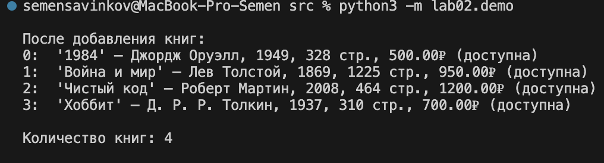
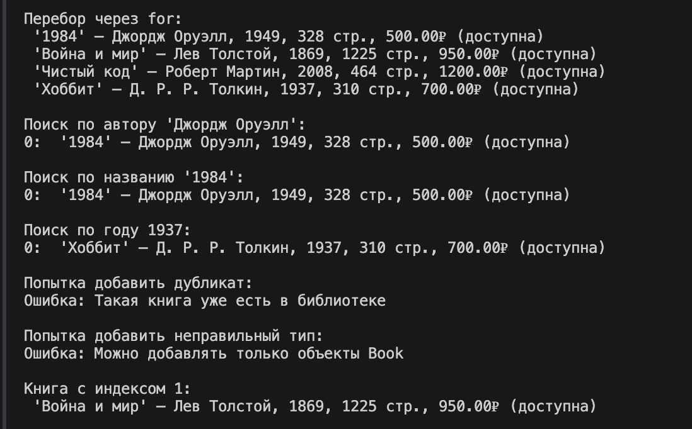
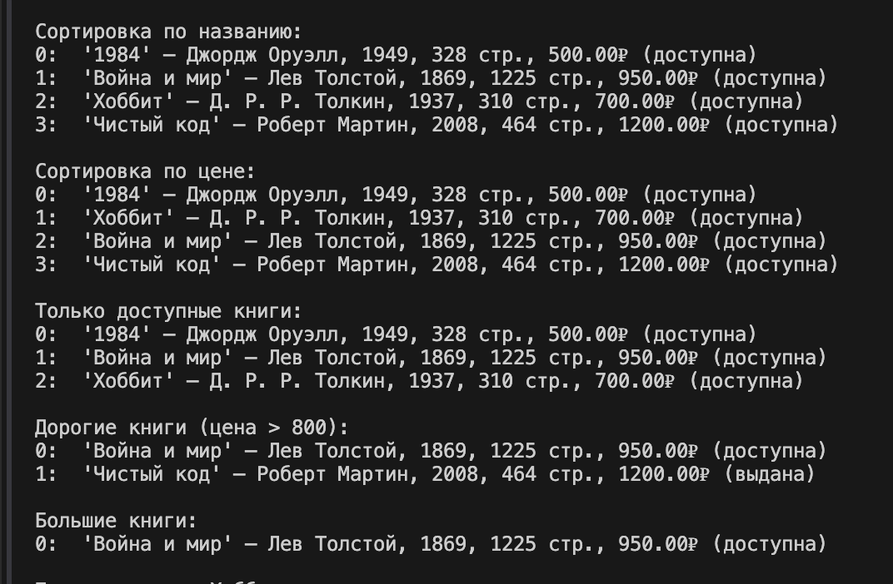
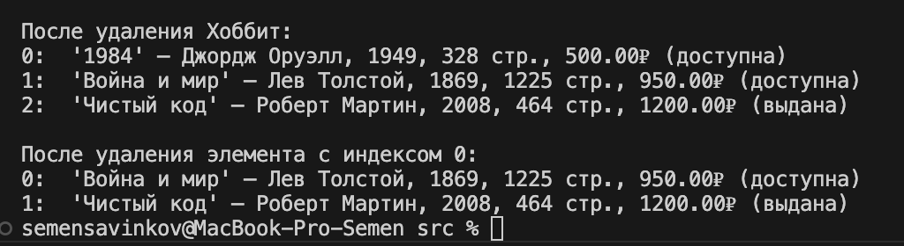

# ЛР-2 — Коллекция объектов (Python 3.x)

## Цель работы

* Научиться работать с **коллекциями объектов**.
* Понять разницу между **моделью сущности и контейнером объектов**.
* Реализовать **собственный контейнерный класс**.
* Освоить **итерацию по объектам**.
* Реализовать базовые операции управления коллекцией.

## Тема
Библиотека / Книги

## Реализованная коллекция
В рамках лабораторной работы реализован контейнерный класс `Library`, предназначенный для хранения и управления объектами `Book`, созданными в ЛР-1.

Коллекция хранит объекты в списке:
    self._items = []

---

## Описание контейнерного класса

Класс `Library` выполняет следующие функции:
- хранит набор объектов `Book`
- управляет добавлением и удалением книг
- предоставляет доступ к элементам коллекции
- поддерживает итерацию
- реализует поиск, сортировку и фильтрацию

---

## Что реализовано

### Базовые методы:
- `add(item)` — добавление книги
- `remove(item)` — удаление книги
- `remove_at(index)` — удаление по индексу
- `get_all()` — получение списка всех книг

### Поиск:
- `find_by_title(title)` — поиск по названию
- `find_by_author(author)` — поиск по автору
- `find_by_year(year)` — поиск по году

### Сортировка:
- `sort(key)` — универсальная сортировка
- `sort_by_title()` — по названию
- `sort_by_price()` — по цене
- `sort_by_year()` — по году

---

## Магические методы

Реализованы специальные методы:
- `__len__()` — позволяет использовать `len(collection)`
- `__iter__()` — позволяет перебирать коллекцию через `for`
- `__getitem__()` — доступ по индексу (`collection[i]`)

---

## Проверки и ограничения

В коллекции реализованы ограничения:
- можно добавлять только объекты `Book`
- запрещено добавление дубликатов (по `title`, `author`, `year`)
- корректная обработка ошибок при:
  - добавлении неправильного типа
  - удалении несуществующего объекта
  - выходе индекса за границы

---

## Логические операции над коллекцией

Методы фильтрации, возвращающие новую коллекцию:
- `get_available()` — только доступные книги
- `get_expensive(min_price)` — книги дороже заданной цены
- `get_big_books()` — книги с большим количеством страниц

---

## Что показано в demo.py

В демонстрационном файле реализованы сценарии:

1. Создание объектов `Book`
2. Добавление книг в коллекцию
3. Вывод содержимого коллекции
4. Использование `len()`
5. Перебор коллекции через `for`
6. Поиск по различным параметрам
7. Проверка запрета дубликатов
8. Проверка добавления неправильного типа
9. Доступ к элементам по индексу
10. Сортировка коллекции
11. Фильтрация (доступные, дорогие, большие книги)
12. Удаление элемента
13. Удаление по индексу

---

## Сценарии работы 

Добавление товаров в каталог:

Поиск,индексация:

Сортировка 

Удаление:

## Вывод

В ходе лабораторной работы освоены:
- работа с коллекциями объектов
- создание собственного контейнерного класса
- реализация базовых операций управления коллекцией
- использование магических методов Python
- фильтрация и сортировка объектов