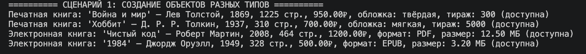
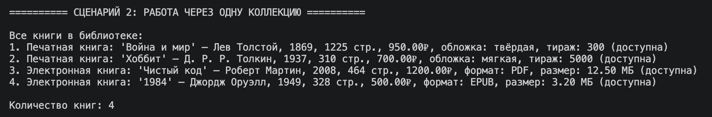
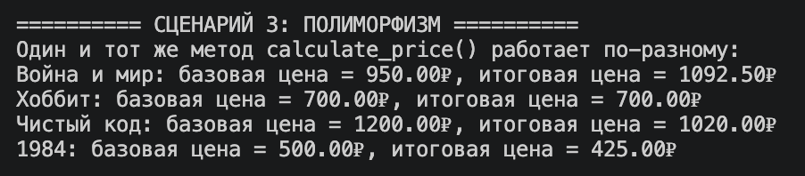
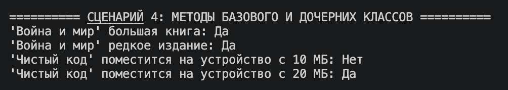
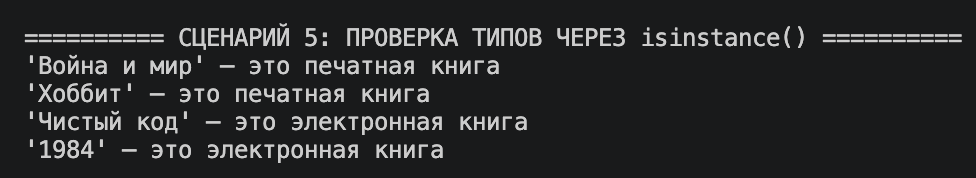
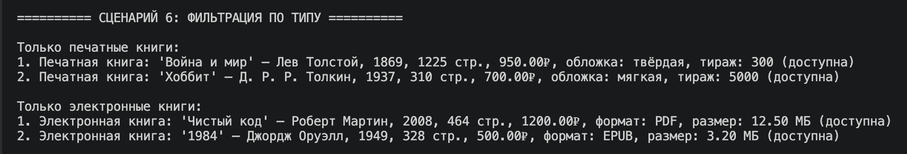
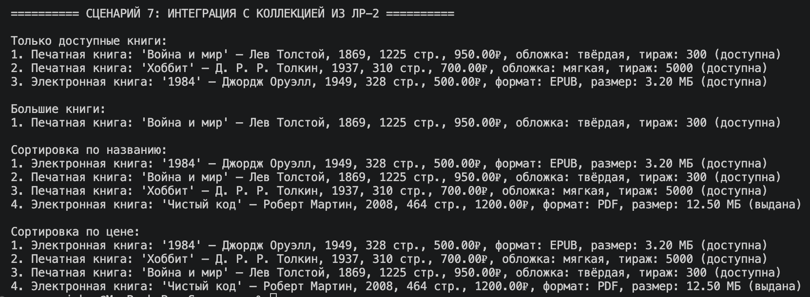

# ЛР-3 — Наследование и иерархия классов

## Вариант 2. Библиотека / Книги

## Цель работы

* Освоить наследование классов.  
* Научиться строить иерархию объектов.  
* Закрепить переопределение методов, полиморфизм и переиспользование кода.

## Реализованная иерархия классов

В работе используется базовый класс `Book` из предыдущих лабораторных работ.  
На его основе реализованы дочерние классы:

- `PrintedBook`
- `EBook`

В файле `base.py` используется общий базовый класс `Book`, который задаёт единый интерфейс поведения для всех видов книг.

## Описание классов

## Book

Базовый класс книги.  
Содержит общие поля:

- название
- автор
- год издания
- количество страниц
- цену
- доступность книги

Поддерживает методы:

- выдачи книги
- возврата книги
- применения скидки
- проверки размера книги

---

## PrintedBook

Печатная книга.

### Дополнительные атрибуты:

- `cover_type`
- `circulation`

### Дополнительный метод:

- `is_rare()`

### Особенность:

Переопределяет `__str__()` и реализует собственный метод `calculate_price()`.

---

## EBook

Электронная книга.

### Дополнительные атрибуты:

- `file_format`
- `file_size`

### Дополнительный метод:

- `can_store_on_device()`

### Особенность:

Переопределяет `__str__()` и реализует собственный метод `calculate_price()`.

---

## Что реализовано

В работе реализованы:

- наследование от базового класса;
- два дочерних класса;
- новые атрибуты и методы в дочерних классах;
- использование `super()`;
- переопределение методов;
- полиморфизм через `calculate_price()`;
- работа коллекции с объектами разных типов;
- фильтрация по типу;
- использование `isinstance()`.

---

## Демонстрация работы

В файле `demo.py` показаны следующие сценарии:

- создание объектов разных типов: `Book`, `PrintedBook`, `EBook`;
- добавление объектов в общую коллекцию `Library`;
- вывод всех объектов;
- вызов методов базового и дочерних классов;
- полиморфизм через общий метод `calculate_price()`;
- проверка типов через `isinstance()`;
- фильтрация объектов по типу;
- использование методов базового класса у наследников;
- сортировка и выборка объектов через коллекцию из ЛР-2.

---

## Сценарии работы программы 📃

Создание и вывод объектов разных типов ✅  

Работа через одну коллекцию ✅  

Полиморфизм через `calculate_price()` ✅  

Методы базового и дочерних классов ✅  

Проверка типов через `isinstance()` ✅  

Фильтрация по типу ✅  

Интеграция с коллекцией из ЛР-2 ✅  

---

## Вывод

В ходе выполнения лабораторной работы были изучены:

- наследование классов;
- построение иерархии объектов;
- переопределение методов;
- полиморфизм;
- использование общего интерфейса поведения;
- работа разных объектов в одной коллекции.

В результате была реализована иерархия классов для библиотеки, где дочерние классы расширяют возможности базового класса и по-разному реализуют общее поведение.