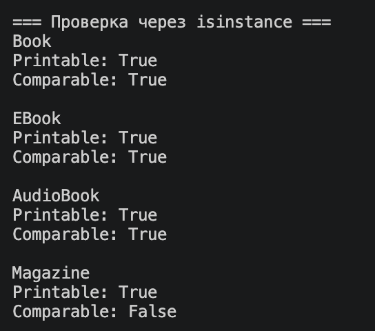
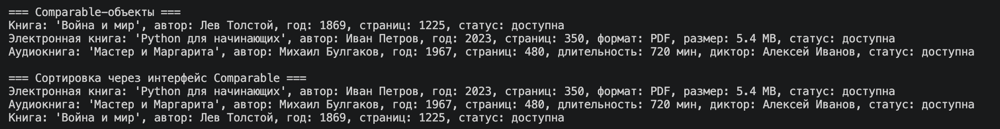
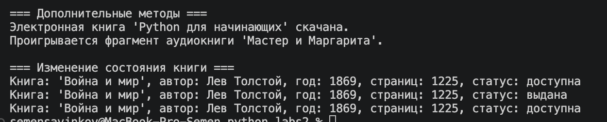

# ЛР-4 — Интерфейсы и абстрактные классы (ABC)

## Цель работы

* Познакомиться с **абстрактными базовыми классами (ABC)**.
* Освоить понятие **интерфейса (контракта поведения)**.
* Научиться **задавать обязательные методы для классов**.
* Закрепить **полиморфизм через единый интерфейс**.
* Научиться **проектировать архитектуру, а не просто классы**.

## Тема

Библиотека / Книги

## Описание интерфейсов

В работе реализованы два интерфейса с использованием абстрактных базовых классов Python.

### Printable

Интерфейс `Printable` задаёт обязательный метод:

- `to_string()`

Назначение:
Позволяет получить строковое представление объекта.
Используется для вывода объектов разных типов через единый интерфейс.

### Comparable

Интерфейс `Comparable` задаёт обязательный метод:

- `compare_to(other)`

Назначение:
Позволяет сравнивать объекты между собой.
В данной работе сравнение выполняется по количеству страниц.

## Реализация в классах

В работе используются следующие классы:

### Book

Базовый класс книги.

Реализует интерфейсы:
- Printable
- Comparable

Функциональность:
- хранит информацию о книге (название, автор, год, страницы)
- поддерживает выдачу и возврат книги
- реализует:
  - `to_string()` — базовое представление книги
  - `compare_to()` — сравнение по количеству страниц

### EBook

Наследуется от класса Book.

Дополнительные атрибуты:
- формат файла
- размер файла

Особенности:
- переопределяет метод `to_string()`
- добавляет метод `download()`

### AudioBook

Наследуется от класса Book.

Дополнительные атрибуты:
- длительность
- диктор

Особенности:
- переопределяет метод `to_string()`
- добавляет метод `play_sample()`

### Magazine

Отдельный класс журнала.

Реализует только интерфейс:
- Printable

Особенность:
- не поддерживает сравнение (не реализует Comparable)

## Коллекция

Реализован класс `LibraryCollection`, который хранит объекты разных типов.

Возможности коллекции:

- добавление объектов
- получение всех объектов
- фильтрация по интерфейсам:
  - `get_printable()`
  - `get_comparable()`
- сортировка объектов через интерфейс Comparable:
  - `sort_comparable()`

Коллекция работает с объектами через интерфейсы, а не через конкретные классы.

## Демонстрация

В файле `demo.py` реализованы следующие сценарии:

### Сценарий 1. Работа через интерфейс Printable

Создаётся список объектов разных типов:
- Book
- EBook
- AudioBook
- Magazine

Все объекты выводятся через единую функцию `print_all()`.

Результат:
один и тот же метод (`to_string()`) работает по-разному для разных классов.

### Сценарий 2. Проверка через isinstance()

Для каждого объекта проверяется:
- реализует ли он Printable
- реализует ли он Comparable

Результат:
показано, что один объект может реализовывать несколько интерфейсов.

### Сценарий 3. Работа с Comparable

Из коллекции выбираются объекты, реализующие Comparable.

Далее:
- вывод списка объектов
- сортировка через метод `compare_to()`

Результат:
реализован полиморфизм через интерфейс без использования условий.

### Дополнительные сценарии

- вызов методов `download()` и `play_sample()`
- изменение состояния книги (выдача и возврат)

## Вывод

В ходе работы были изучены абстрактные базовые классы (ABC) и интерфейсы.
Реализовано использование интерфейсов как контракта поведения.
Показан полиморфизм через единый интерфейс.
Реализована работа коллекции с объектами через интерфейсы.