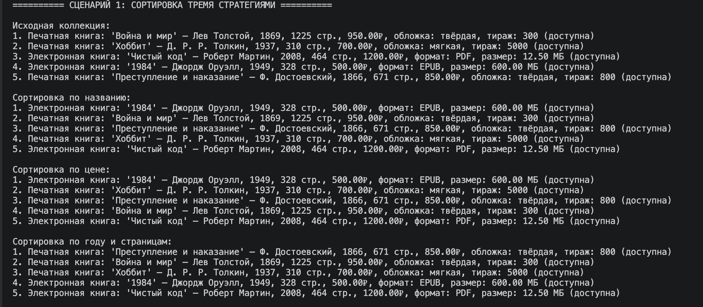
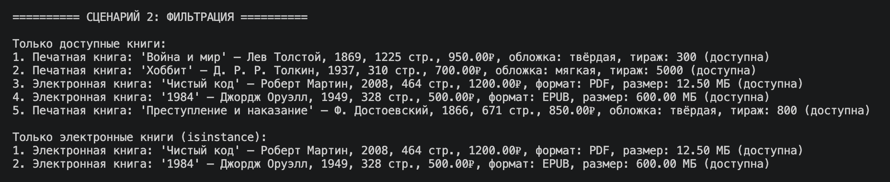
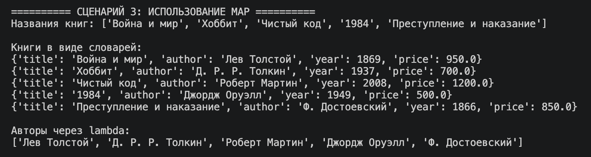
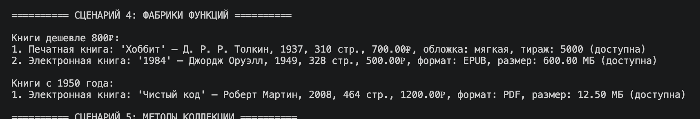
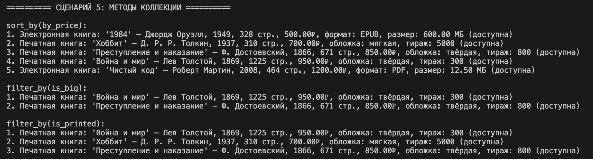
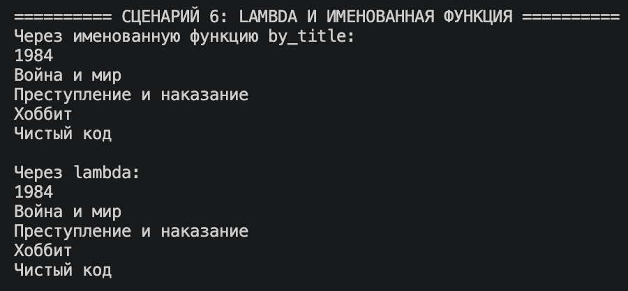
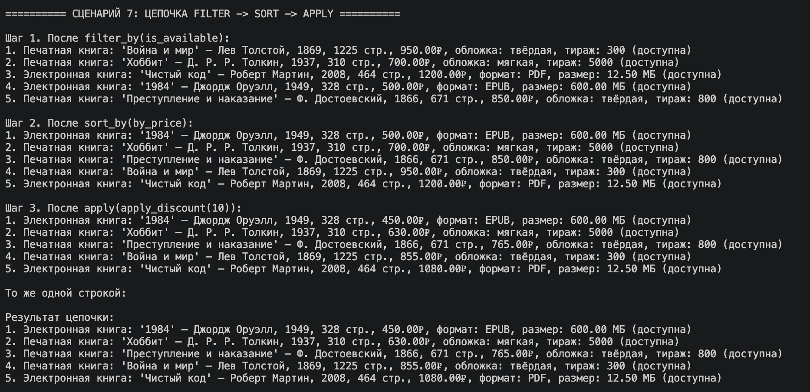
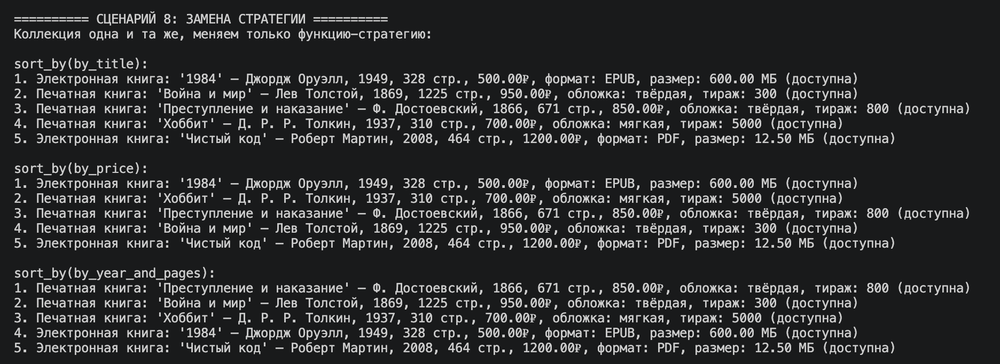
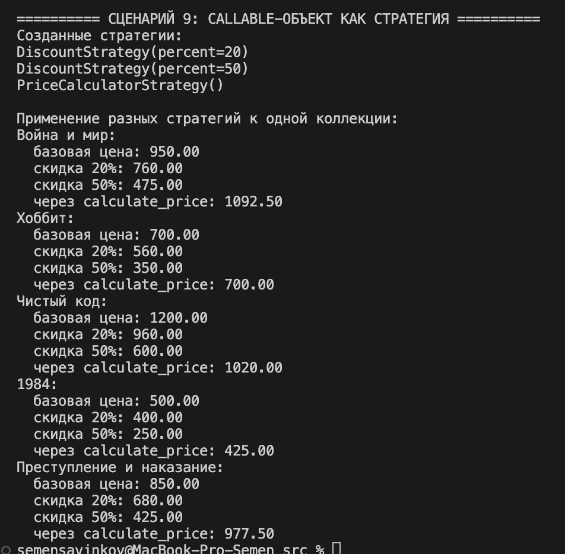

# ЛР-5 — Функции как аргументы. Стратегии и делегаты.

## Вариант 2. Библиотека / Книги

## Цель работы

* Освоить передачу функций как аргументов в другие функции и методы.
* Научиться применять встроенные функции высшего порядка: `map`, `filter`, `sorted`.
* Понять концепцию паттерна «Стратегия» и реализовать его на Python.
* Освоить lambda-выражения и их практическое применение.
* Интегрировать функциональный стиль с объектно-ориентированным кодом из предыдущих ЛР.

## Реализованные функции и стратегии

В работе используются объекты `Book`, `PrintedBook`, `EBook` из предыдущих лабораторных.
Все стратегии, фильтры и фабрики вынесены в отдельный файл `strategies.py` и снабжены docstring.

### Функции-стратегии сортировки

- `by_title` - по названию книги
- `by_price` - по цене
- `by_year_and_pages` - по нескольким атрибутам (год + страницы)

### Функции-фильтры

- `is_available` - только доступные книги
- `is_big` - большие книги
- `is_printed` - только печатные (через `isinstance`)
- `is_ebook` - только электронные (через `isinstance`)

### Функции для map()

- `to_title` - извлечь название
- `to_dict` - преобразовать книгу в словарь

### Фабрики функций (замыкания)

- `make_price_filter(max_price)` - создаёт фильтр по максимальной цене
- `make_year_filter(min_year)` - создаёт фильтр по минимальному году
- `apply_discount(percent)` - создаёт функцию, применяющую скидку

### Callable-объекты (паттерн «Стратегия»)

- `DiscountStrategy(percent)` - стратегия расчёта цены со скидкой
- `PriceCalculatorStrategy()` - стратегия через полиморфный `calculate_price()` из ЛР-3

Каждая стратегия реализует метод `__call__`, поэтому экземпляр класса можно использовать как обычную функцию.

### Расширение коллекции

Класс `BookCollection` поддерживает методы:

- `sort_by(key_func)` - сортировка по функции
- `filter_by(predicate)` - фильтрация по предикату
- `apply(func)` - применение функции ко всем элементам

Все методы возвращают новый экземпляр коллекции, что позволяет строить цепочки вызовов.

### Паттерн «Стратегия»

Паттерн реализован двумя способами:

1. Через обычные функции - передаются как аргументы в `sort_by`, `filter_by`, `apply`.
2. Через callable-объекты - классы с методом `__call__`, которые можно вызывать как функции и которые могут хранить состояние.

## Демонстрация работы

В `demo.py` реализованы следующие сценарии:

### Сортировка тремя стратегиями

### Фильтрация

### Использование map

### Фабрики функций

### Методы коллекции sort_by / filter_by

### Lambda и именованная функция

### Цепочка filter → sort → apply

### Замена стратегии без изменения кода коллекции

### Callable-объект как стратегия

## Вывод

В ходе выполнения лабораторной работы были изучены:

- передача функций как аргументов;
- lambda-выражения;
- функции высшего порядка `map`, `filter`, `sorted`;
- замыкания и фабрики функций;
- паттерн «Стратегия» через обычные функции и через callable-объекты;
- цепочка вызовов методов коллекции.

В результате коллекция `BookCollection` стала гибкой: логика сортировки, фильтрации и преобразования теперь отделена от самой коллекции и может быть заменена передачей другой функции без изменения её кода.