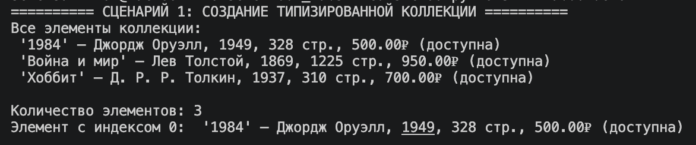
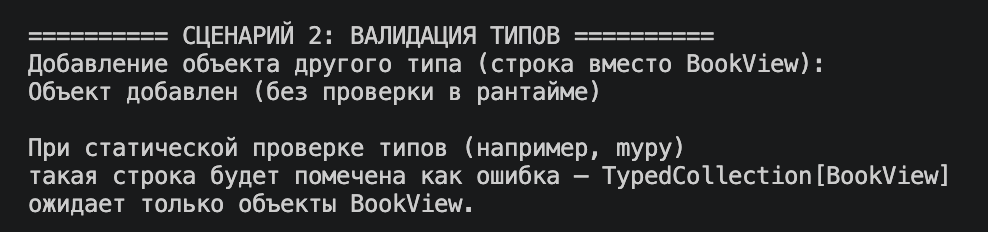
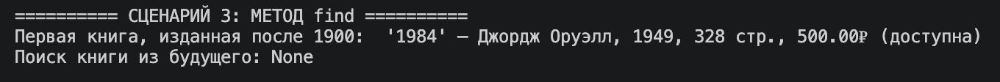
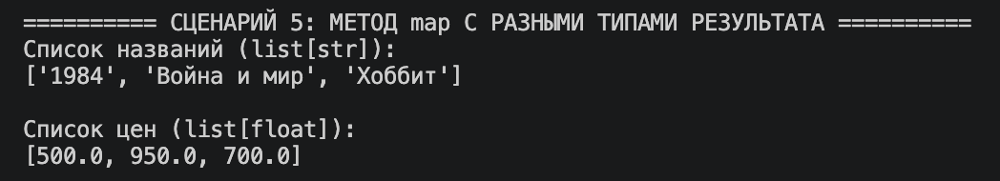
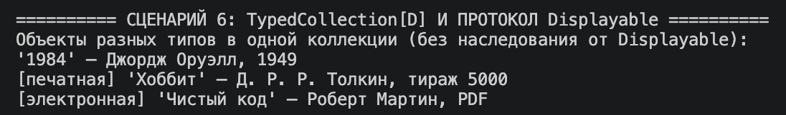
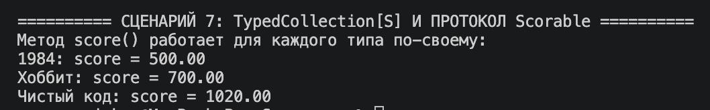

# ЛР-6 — Generics и typing

## Вариант 2. Библиотека / Книги

## Цель работы

* Освоить систему аннотаций типов в Python (`typing`).
* Научиться создавать обобщённые (generic) классы с помощью `TypeVar` и `Generic`.
* Понять концепцию структурной типизации через `typing.Protocol`.

## Описание реализованных типов и контейнеров

В работе используются объекты `Book`, `PrintedBook`, `EBook` из предыдущих лабораторных.

### Generic-класс TypedCollection

В файле `container.py` реализован обобщённый класс `TypedCollection[T]`, который повторяет интерфейс коллекции из ЛР-2, но теперь знает, какой тип хранится внутри.

Аннотации позволяют IDE и статическим анализаторам подсказывать типы и находить ошибки до запуска программы.

### Использованные TypeVar

- `T` - тип элементов коллекции
- `R` - тип результата метода `map()` (может отличаться от `T`)
- `D` - тип с ограничением `bound=Displayable`
- `S` - тип с ограничением `bound=Scorable`

### Реализованные методы коллекции

- `add(item: T) -> None` - добавить элемент
- `remove(item: T) -> None` - удалить элемент
- `get_all() -> list[T]` - получить копию списка элементов
- `find(predicate: Callable[[T], bool]) -> Optional[T]` - найти первый подходящий элемент или `None`
- `filter(predicate: Callable[[T], bool]) -> list[T]` - отфильтровать элементы
- `map(transform: Callable[[T], R]) -> list[R]` - преобразовать элементы (тип результата может отличаться)
- `__len__`, `__iter__`, `__getitem__` - стандартные dunder-методы

### Протоколы (структурная типизация)

В `container.py` объявлены два протокола:

- `Displayable` - описывает объекты, у которых есть метод `display() -> str`
- `Scorable` - описывает объекты, у которых есть метод `score() -> float`

Классы не наследуются от этих протоколов явно. Достаточно того, что у них есть соответствующие методы - Python проверяет соответствие по структуре.

### Классы-наследники для демонстрации протоколов

Так как классы из ЛР-1 и ЛР-3 не должны наследоваться от протоколов напрямую, для демонстрации в `container.py` созданы наследники с добавленными методами:

- `BookView(Book)` - добавляет `display()` и `score()`
- `PrintedBookView(PrintedBook)` - добавляет `display()` и `score()`
- `EBookView(EBook)` - добавляет `display()` и `score()`

Все три класса автоматически попадают под протоколы `Displayable` и `Scorable`, потому что имеют нужные методы.

## Демонстрация работы

В `demo.py` реализованы следующие сценарии:

### Создание типизированной коллекции

### Валидация типов

### Метод find

### Метод filter

### Метод map с разными типами результата

### TypedCollection[D] и протокол Displayable

### TypedCollection[S] и протокол Scorable

## Вывод

В ходе выполнения лабораторной работы были изучены:

- аннотации типов и их роль в чтении и поддержке кода;
- обобщённые классы через `Generic` и `TypeVar`;
- использование нескольких `TypeVar` в одном классе для методов с другим типом результата;
- структурная типизация через `Protocol`;
- ограничения типов через `bound=`;
- разница между явным наследованием и структурным соответствием.

В результате коллекция `TypedCollection` стала универсальной и одновременно безопасной с точки зрения типов: один и тот же класс работает с разными ограничениями (`Displayable`, `Scorable`) без изменения кода самой коллекции.