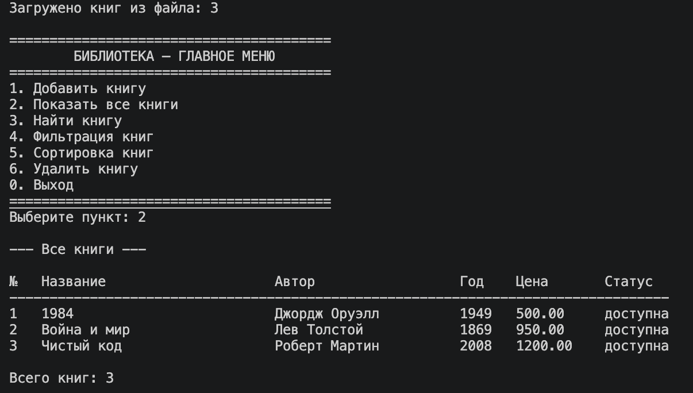
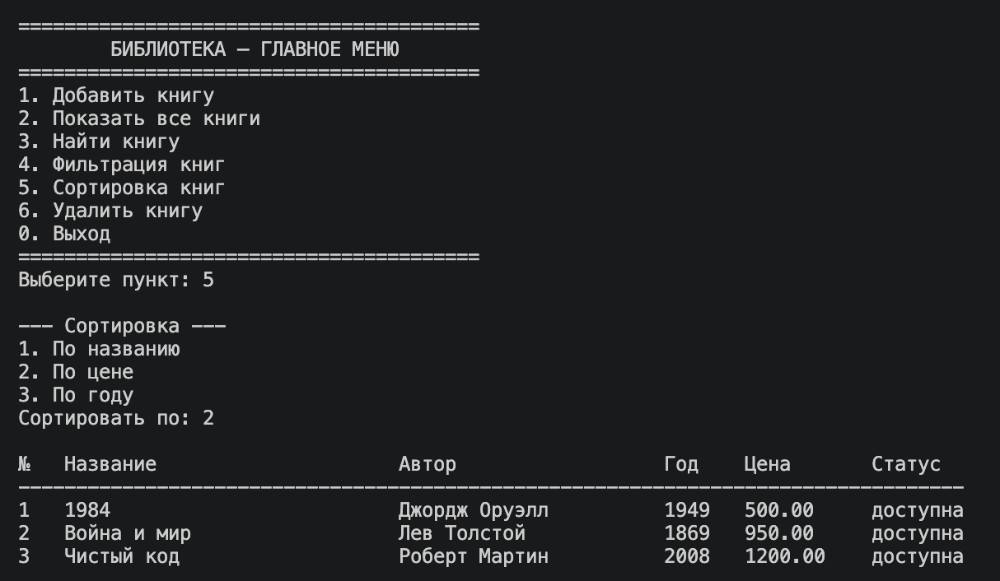
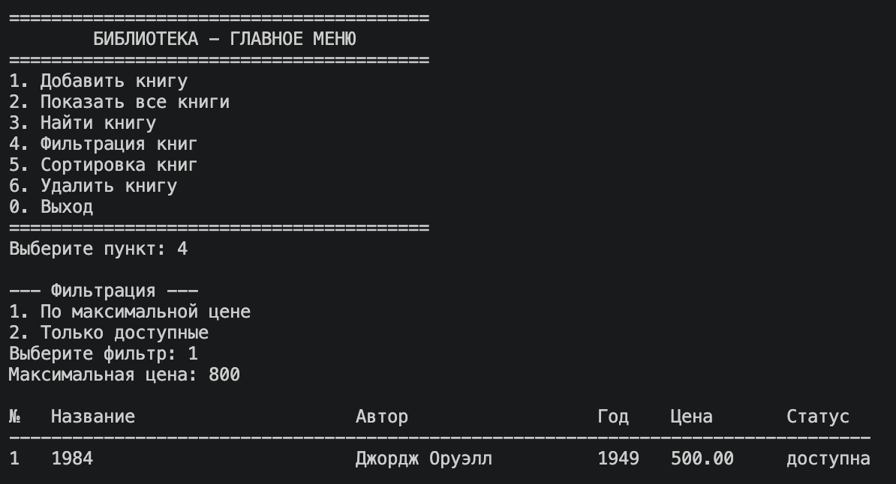
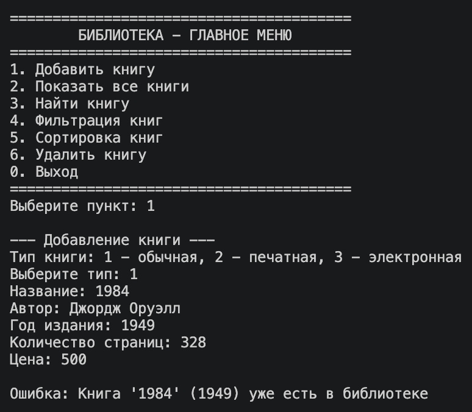
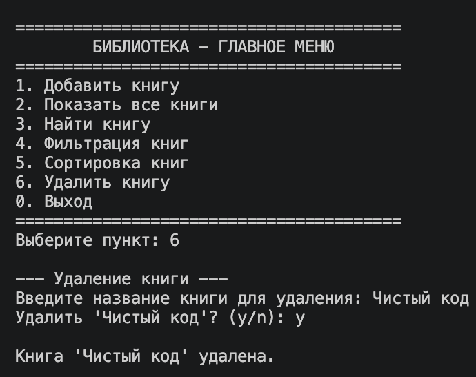
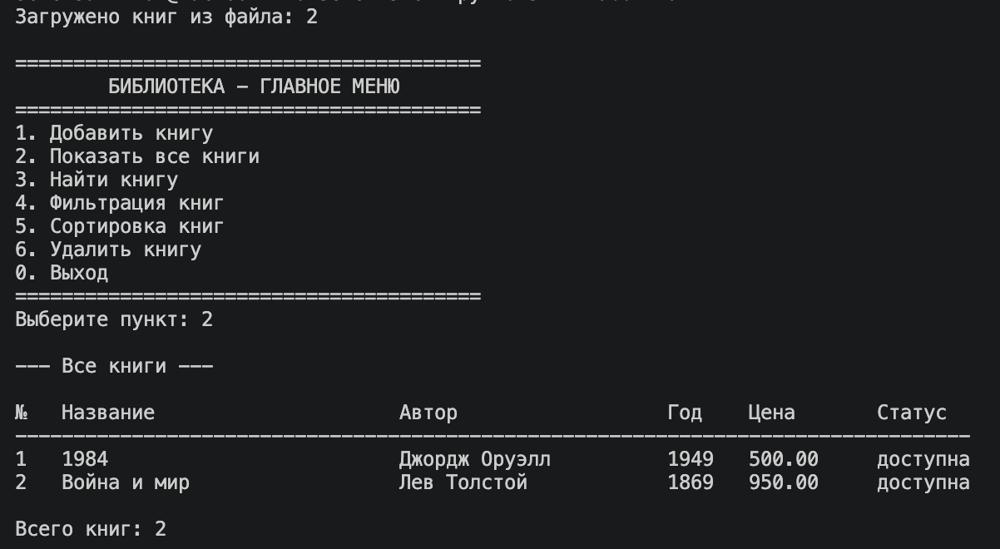

# ЛР-7 - Консольное приложение

## Вариант 2. Библиотека / Книги

## 1. Цель работы

Объединить все знания из ЛР1-ЛР6 в единое работающее приложение и реализовать интерактивный CLI-интерфейс с меню и вводом пользователя.

В работе применены:

- классы предметной области из ЛР-1 и иерархия из ЛР-3 (Book, PrintedBook, EBook);
- функции-стратегии сортировки и фильтрации из ЛР-5;
- аннотации типов из ЛР-6;
- разделение на слои, обработка исключений и сохранение данных в файл.

## 2. Структура проекта

Проект разделён на отдельные модули, каждый из которых отвечает за свою задачу:

- main.py - точка входа. Создаёт приложение и запускает CLI.
- cli.py - слой интерфейса. Отвечает только за меню, ввод и вывод. Бизнес-логики не содержит.
- app.py - слой бизнес-логики. Управляет коллекцией книг: добавление, удаление, поиск, фильтрация, сортировка. CLI обращается к данным только через этот слой.
- exceptions.py - собственные исключения предметной области.
- storage.py - сохранение и загрузка коллекции в JSON-файл.

Классы предметной области (Book, PrintedBook, EBook) импортируются из ЛР-1 и ЛР-3 и не изменяются.

### Разделение на слои

CLI -> app.py -> models (lab01, lab03). То есть слой ввода/вывода обращается к слою бизнес-логики, а тот - к предметной области. CLI не обращается к коллекции напрямую - только через методы app.py. Это делает код читаемым и позволяет менять интерфейс независимо от логики.

## 3. Описание CLI

### Пункты меню

1. Добавить книгу
2. Показать все книги
3. Найти книгу
4. Фильтрация книг
5. Сортировка книг
6. Удалить книгу
0. Выход

- Добавить книгу - поддерживает три типа: обычная, печатная, электронная.
- Показать все книги - выводит коллекцию в виде форматированной таблицы.
- Найти книгу - поиск по названию.
- Фильтрация - по максимальной цене или только доступные книги.
- Сортировка - по названию, цене или году (выбор стратегии через подменю).
- Удалить книгу - с подтверждением (y/n) перед удалением.
- Выход - сохраняет данные в файл.

### Обработка ошибок ввода

При вводе строки вместо числа приложение перехватывает ValueError и сообщает об ошибке, не завершаясь аварийно:

    try:
        choice = int(input("Выберите пункт: "))
    except ValueError:
        print("Ошибка: введите число")

### Собственные исключения

В exceptions.py определены исключения предметной области:

- LibraryError - базовое исключение приложения.
- ItemNotFoundError - книга не найдена в коллекции.
- DuplicateItemError - книга с такими данными уже существует.

Например, при попытке добавить дубликат app.py бросает DuplicateItemError, а cli.py его перехватывает и выводит понятное сообщение.

### Сохранение и загрузка данных

Данные хранятся в файле data/library.json в корне проекта. При запуске приложение автоматически загружает книги из файла, при выходе - сохраняет. Для каждой книги в JSON хранится поле type (book, printed, ebook), благодаря чему при загрузке восстанавливается правильный класс из иерархии.

### Запуск

    cd src
    python3 -m lab07.main

## 4. Демонстрация работы

### Сценарий 1: запуск и автозагрузка данных

При запуске приложение загружает книги из data/library.json и выводит их через меню.

### Сценарий 2: сортировка с выбором стратегии

Выбор стратегии сортировки через подменю (по названию, цене или году).

### Сценарий 3: фильтрация

Фильтрация коллекции по максимальной цене.

### Сценарий 4: перехват исключения

Перехват собственного исключения DuplicateItemError при попытке добавить дубликат книги.

### Сценарий 5: удаление с подтверждением

Удаление книги с подтверждением операции (y/n) и сохранение данных при выходе.

### Сценарий 6: повторный запуск - данные сохранились

После перезапуска приложение загружает обновлённые данные: удалённая книга отсутствует, осталось 2 книги.

## 5. Вывод

В ходе выполнения лабораторной работы были изучены:

- разбиение приложения на модули и слои (интерфейс, бизнес-логика, предметная область);
- построение интерактивного CLI-интерфейса с циклическим меню;
- обработка некорректного ввода пользователя;
- создание и перехват собственных исключений;
- сохранение и загрузка данных через JSON-файл;
- применение аннотаций типов и docstring во всех публичных функциях.

В результате все знания из предыдущих лабораторных были объединены в единое работающее приложение: предметная область из ЛР-1 и ЛР-3, стратегии из ЛР-5 и типизация из ЛР-6 используются совместно через слой бизнес-логики, доступный из консольного интерфейса.